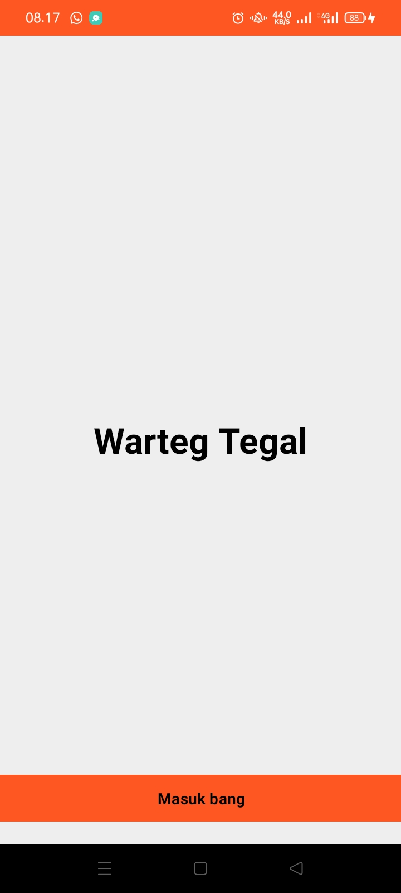
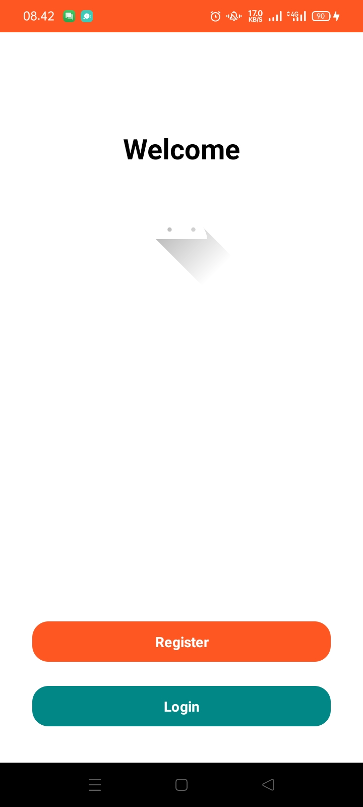
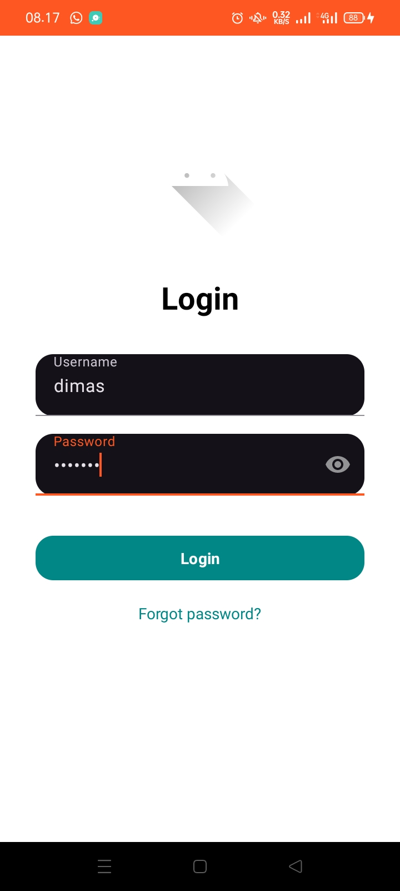
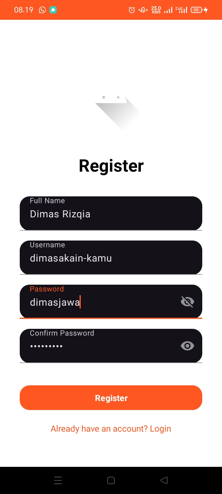
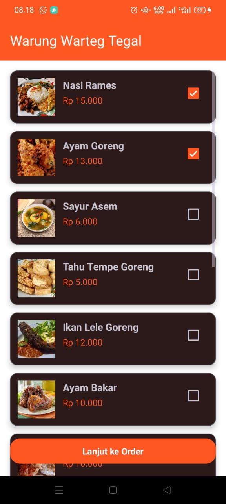
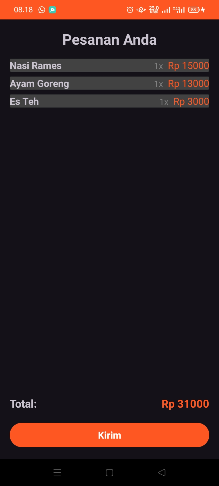
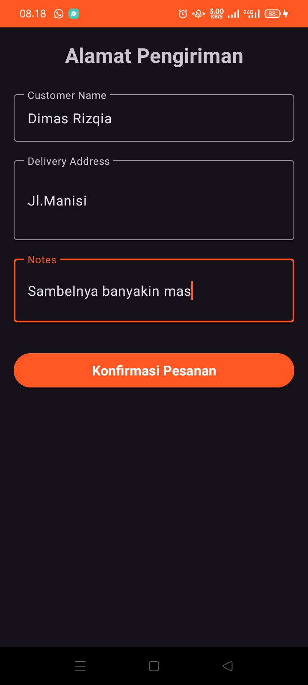
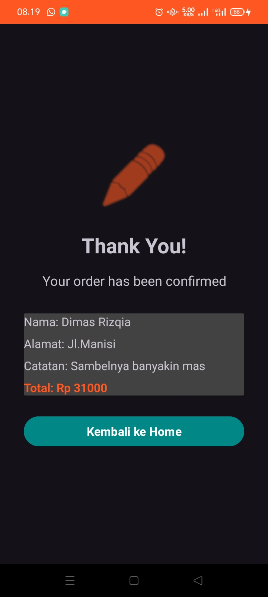

# 🍽 Warung Warteg Tegal
Aplikasi Mobile sederhana untuk melakukan pemesanan makanan secara online pada Warung Warteg Tegal.  
Aplikasi ini dibuat sebagai tugas **UTS** pada mata kuliah **Pengembangan Aplikasi Mobile**.

---

## 👤 Identitas
| Keterangan | Data |
|------------|------|
| **Nama** | Dimas Rizqia Hidayat |
| **NIM** | 1237050073 |
| **Kelas** | 5A |
| **Mata Kuliah** | Pengembangan Aplikasi Mobile |
| **Dosen Pengampu** | H. Aldy Rialdy Atmadja M. T |

---

## 📌 Fitur Utama Aplikasi
✅ Splash Screen  
✅ Pilihan Login / Register  
✅ Login dengan Email & Password  
✅ Register Akun Baru  
✅ Menampilkan daftar menu makanan  
✅ Menambahkan makanan ke pesanan  
✅ Menghitung total harga otomatis  
✅ Input data pengiriman  
✅ Halaman konfirmasi pesanan

---

## 🧩 Teknologi & Library
- Android Studio
- Kotlin
- RecyclerView
- Parcelable
- Material Design Components
- Intent Navigation

---

## 📱 Dokumentasi Halaman (Screenshot)

---

### ✅ 1. **SplashActivity**
Halaman pembuka aplikasi dengan animasi / logo sebelum masuk ke halaman berikutnya.

📸 *Screenshot:*  

---

### ✅ 2. **AuthChoiceActivity**
Halaman untuk memilih tindakan: Login atau Register.

📸 *Screenshot:*  

---

### ✅ 3. **LoginActivity**
Halaman untuk login menggunakan email & password.

📸 *Screenshot:*  

---

### ✅ 4. **RegisterActivity**
Halaman pendaftaran akun untuk pengguna baru.

📸 *Screenshot:*  

---

### ✅ 5. **HomeActivity**
Menampilkan daftar menu makanan lengkap beserta gambar dan harga.
Pengguna dapat memilih menu untuk masuk ke pesanan.

📸 *Screenshot:*  

---

### ✅ 6. **OrderActivity**
Menampilkan ringkasan pesanan:
✔ Nama makanan  
✔ Jumlah  
✔ Total harga otomatis

📸 *Screenshot:*  

---

### ✅ 7. **AddressActivity**
Form pengisian data:
- Nama pemesan
- Alamat pengiriman
- Catatan tambahan

📸 *Screenshot:*  

---

### ✅ 8. **ConfirmationActivity**
Menampilkan informasi akhir pesanan sebelum kembali ke Home.

📸 *Screenshot:*  

---
